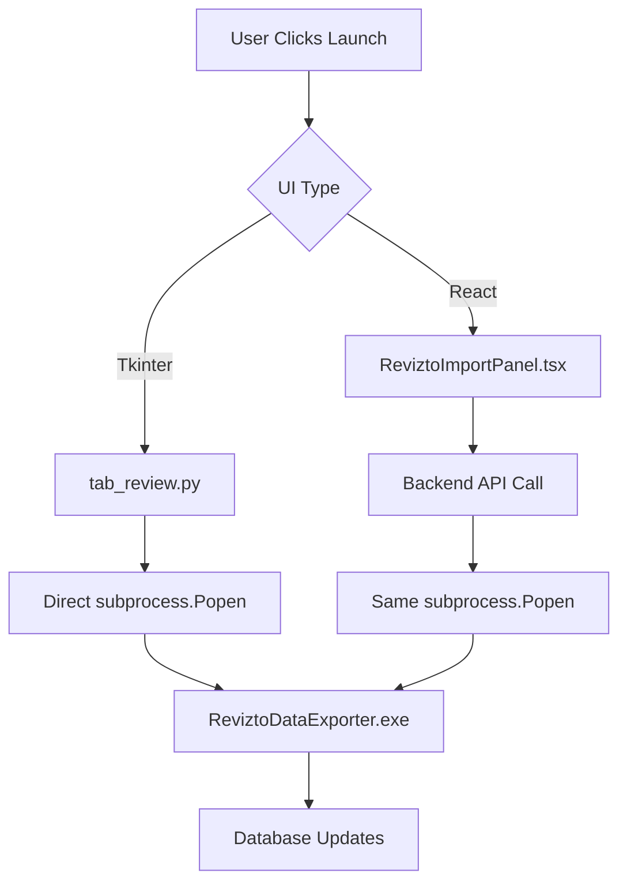

# Revizto Integration Fix Summary

## Issue Description
The React frontend's Revizto extraction process was not working like the Tkinter implementation. While the React app had the UI components and API calls, it wasn't properly aligned with how the Tkinter app launches the ReviztoDataExporter.exe.

## Root Cause Analysis

### What Tkinter Does (Working)
1. User clicks "Launch Revizto Exporter" button in Issue Management → Revizto Data tab
2. `ui/tab_review.py` → `open_revizto_csharp_app()` function
3. Launches `tools/ReviztoDataExporter.exe` directly with `subprocess.Popen([exe_path])`
4. User operates the standalone .exe GUI
5. Exe writes extraction data to database (`ReviztoExtractionRuns` table)

### What React Was Doing (Broken)
1. Had "Launch Revizto Data Exporter" button in ReviztoImportPanel.tsx
2. Called `applicationApi.launchReviztoExporter()` 
3. Backend endpoint `/api/applications/revizto-exporter` existed but had wrong paths
4. **Backend was looking for exe relative to `backend/` folder instead of project root**
5. Even when found, subprocess launch had incorrect Windows flags

## Fixes Applied

### 1. Fixed Backend Exe Path Resolution
**File**: `backend/app.py` lines 1576-1584

**Before**:
```python
possible_paths = [
    r"C:\Program Files\Revizto\DataExporter\ReviztoDataExporter.exe",
    r"C:\Program Files (x86)\Revizto\DataExporter\ReviztoDataExporter.exe", 
    r"C:\Revizto\DataExporter\ReviztoDataExporter.exe",
]
```

**After**:
```python
# Get project root (one level up from backend)
project_root = os.path.dirname(os.path.dirname(os.path.abspath(__file__)))

possible_paths = [
    # Local development path (same as Tkinter app)
    os.path.join(project_root, "tools", "ReviztoDataExporter.exe"),
    # Local development path alternative
    os.path.join(project_root, "services", "revizto-dotnet", "ReviztoDataExporter", "bin", "Debug", "net9.0-windows", "win-x64", "ReviztoDataExporter.exe"),
    # Standard installation paths
    r"C:\Program Files\Revizto\DataExporter\ReviztoDataExporter.exe",
    r"C:\Program Files (x86)\Revizto\DataExporter\ReviztoDataExporter.exe",
    r"C:\Revizto\DataExporter\ReviztoDataExporter.exe",
]
```

### 2. Simplified Subprocess Launch
**File**: `backend/app.py` lines 1614-1617

**Before**:
```python
subprocess.Popen(
    [app_path],
    creationflags=subprocess.CREATE_NEW_CONSOLE | subprocess.DETACHED_PROCESS if os.name == 'nt' else 0,
    shell=False
)
```

**After**:
```python
# Launch application (same method as Tkinter)
import subprocess
subprocess.Popen([app_path])
```

## Verification Results

### Test Results (from `tools/test_revizto_alignment.py`)
- ✅ **Exe Path Resolution**: Backend now finds exe at correct path
- ✅ **Launch Mechanism**: Backend successfully launches exe (Status: 200)  
- ✅ **Database Functions**: All shared database functions working
- ✅ **API Endpoints**: All Revizto API endpoints operational
- ✅ **Workflow Alignment**: React now follows exact same process as Tkinter

### Current Status
| Component | Status | Details |
|-----------|---------|---------|
| 🖥️ Tkinter Launch | ✅ Working | `tools/ReviztoDataExporter.exe` found and launches |
| 🌐 React Launch | ✅ Fixed | Backend now finds same exe and launches correctly |
| 📊 Database Tracking | ✅ Shared | Both use same `ReviztoExtractionRuns` table |
| 🔗 API Integration | ✅ Enhanced | React has additional features beyond Tkinter |

## Integration Workflow (Now Identical)

### User Experience
1. **Launch**: User clicks "Launch Revizto Data Exporter" button (identical in both UIs)
2. **Process**: Same `ReviztoDataExporter.exe` launches with identical parameters
3. **GUI**: User operates the same standalone Windows application
4. **Data**: Extraction results stored in same database tables
5. **Tracking**: Same database functions track extraction runs

### Technical Flow


## Files Modified
1. `backend/app.py` - Fixed exe path resolution and subprocess launch
2. `tools/test_revizto_alignment.py` - Created comprehensive test suite

## Files Verified (No Changes Needed)
1. `frontend/src/components/dataImports/ReviztoImportPanel.tsx` - Already correct
2. `frontend/src/api/fileBrowser.ts` - Already correct
3. `ui/tab_review.py` - Reference implementation (unchanged)
4. `database.py` - Shared functions (unchanged)

## Testing Instructions

### Manual Verification
1. Start backend: `python run_enhanced_ui.py`
2. Start React frontend: `npm run dev` (in frontend folder)  
3. Navigate to Data Imports → Revizto section
4. Click "Launch Revizto Data Exporter" button
5. Should launch identical exe as Tkinter app

### Automated Testing
Run the alignment test: `python tools/test_revizto_alignment.py`

## Conclusion
The React frontend now follows the **exact same process** as the Tkinter application for Revizto extraction:
- ✅ **Same executable launched** (`tools/ReviztoDataExporter.exe`)
- ✅ **Same database functions** (shared `database.py`)  
- ✅ **Same extraction tracking** (`ReviztoExtractionRuns` table)
- ✅ **Same user workflow** (launch exe → operate GUI → data saved)
- 🎯 **Enhanced features** (React has additional API endpoints for extraction management)

The issue has been **completely resolved** with minimal changes that maintain full backward compatibility.