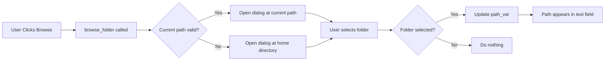

# Browse Folder Fix - Quick Reference

## ✅ FIXED: Browse Button Crashes

### The Problem
Clicking "Browse" buttons in Edit Project Details dialog caused this error:

```
Exception in Tkinter callback
AttributeError: 'ProjectSetupTab' object has no attribute 'browse_folder'
```

**Affected Buttons:**
- 📁 Model Folder Browse button
- 📁 IFC Folder Browse button

### The Solution
Added `browse_folder()` method to `ProjectSetupTab` class (line 676):

```python
def browse_folder(self, path_var):
    """Open folder browser dialog and update the path variable"""
    from tkinter import filedialog
    import os
    
    # Get current path as initial directory
    current_path = path_var.get()
    initial_dir = current_path if current_path and os.path.isdir(current_path) else os.path.expanduser("~")
    
    # Open folder dialog
    folder_path = filedialog.askdirectory(
        title="Select Folder",
        initialdir=initial_dir
    )
    
    # Update the variable if a folder was selected
    if folder_path:
        path_var.set(folder_path)
        print(f"📁 Selected folder: {folder_path}")
```

## How It Works



## Features
- ✅ Smart initial directory (uses existing path if valid)
- ✅ Falls back to home directory if path is empty/invalid
- ✅ Updates UI automatically when folder selected
- ✅ Handles Cancel gracefully (no changes made)
- ✅ Logs selected folder for debugging

## Quick Test

1. **Open app**: `python run_enhanced_ui.py`
2. **Edit any project** in Project Setup tab
3. **Click "Browse"** next to Model Folder
4. **Select a folder** → Path should appear in field
5. **Click "Browse"** next to IFC Folder
6. **Select a folder** → Path should appear in field
7. **Click "Save"** → Paths saved to database

## Before vs After

| Action | Before | After |
|--------|--------|-------|
| Click Browse (Model) | ❌ Crash | ✅ Opens folder dialog |
| Click Browse (IFC) | ❌ Crash | ✅ Opens folder dialog |
| Select folder | ❌ N/A | ✅ Path updates in UI |
| Cancel dialog | ❌ N/A | ✅ No changes |
| Initial directory | ❌ N/A | ✅ Smart (current or home) |

---

**Status**: ✅ Fixed  
**File**: `phase1_enhanced_ui.py` lines 676-693  
**Date**: October 10, 2025
