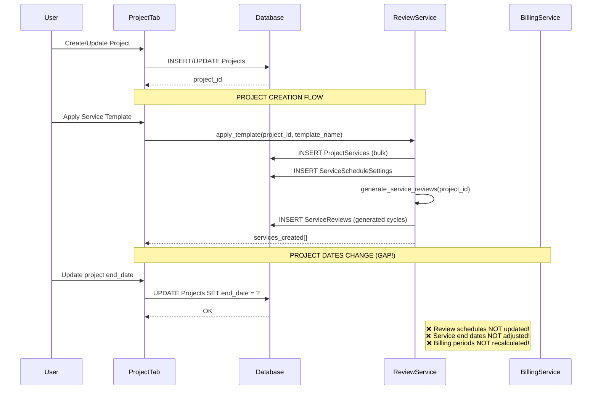

# BIM Project Management - Cross-Function Data Flow Analysis

**Date**: October 3, 2025  
**Version**: 1.0  
**Analysis Scope**: Project ID propagation, bidirectional data synchronization, and referential integrity

---

## Executive Summary

This document provides a comprehensive analysis of how data flows across the BIM Project Management system, focusing on:
- **Project ID propagation** across all modules and services
- **Bidirectional synchronization** between related entities
- **Client and date dependencies** across project lifecycle
- **Review scheduling** and its integration with project parameters
- **Identified gaps** and recommended solutions

### Critical Findings

🔴 **High Priority Issues**:
1. Missing bidirectional update when project dates change → review schedules not auto-updated
2. Client information changes don't propagate to billing claims
3. Project deletion has manual CASCADE deletes (no DB-level CASCADE enforcement)
4. UI tabs lack centralized notification system for cross-tab updates
5. No automatic recalculation of service progress when review statuses change

🟡 **Medium Priority Issues**:
6. Review scheduling doesn't validate against project start/end dates
7. Task dependencies don't check project boundaries
8. Issue analytics service queries project data but doesn't cache project metadata

---

## 1. Database Schema Relationships

### 1.1 Core Entity Relationships

```
Projects (project_id) [ROOT ENTITY]
    ├── client_id → Clients.client_id
    ├── type_id → ProjectTypes.type_id
    ├── sector_id → Sectors.sector_id
    ├── start_date, end_date [TEMPORAL BOUNDS]
    │
    ├─→ ProjectServices (project_id) [1:N]
    │   ├── service_id [PK]
    │   ├── phase, service_code, service_name
    │   ├── unit_qty, unit_rate, agreed_fee
    │   ├── bill_rule, notes
    │   │
    │   ├─→ ServiceReviews (service_id) [1:N]
    │   │   ├── review_date, status, notes
    │   │   ├── manual_override
    │   │   └── progress tracking
    │   │
    │   ├─→ ServiceDeliverables (service_id) [1:N]
    │   │   ├── deliverable_type
    │   │   ├── planned_date, issued_date
    │   │   ├── status, bill_trigger
    │   │   └── evidence_link
    │   │
    │   └─→ ServiceScheduleSettings (service_id) [1:1]
    │       ├── start_date, end_date
    │       ├── review_frequency, num_reviews
    │       └── last_generated_date
    │
    ├─→ ReviewSchedule (project_id, cycle_id) [1:N]
    │   ├── schedule_id [PK]
    │   ├── review_date [DATE]
    │   ├── assigned_to → Users.user_id
    │   ├── status (planned/in_progress/completed)
    │   ├── is_blocked, is_within_license_period
    │   └── manual_override
    │
    ├─→ ReviewParameters (project_id, cycle_id) [1:N]
    │   ├── ReviewStartDate, NumberOfReviews
    │   ├── ReviewFrequency (daily/weekly/monthly)
    │   ├── LicenseStartDate, LicenseEndDate
    │   └── [Used for review generation]
    │
    ├─→ Tasks (project_id) [1:N]
    │   ├── task_id [PK]
    │   ├── task_name, description
    │   ├── start_date, end_date
    │   ├── assigned_to → Users.user_id
    │   ├── progress, status, priority
    │   ├── predecessor_task_id [SELF-REFERENCING]
    │   ├── estimated_hours, actual_hours
    │   └── review_id → ServiceReviews.review_id
    │
    ├─→ BillingClaims (project_id) [1:N]
    │   ├── claim_id [PK]
    │   ├── period_start, period_end
    │   ├── po_ref, invoice_ref, status
    │   │
    │   └─→ BillingClaimLines (claim_id) [1:N]
    │       ├── service_id → ProjectServices.service_id
    │       ├── stage_label
    │       ├── prev_pct, curr_pct, delta_pct
    │       ├── amount_this_claim
    │       └── note
    │
    ├─→ ACCImportFolders (project_id) [1:1]
    │   ├── acc_folder_path
    │   └── last_import_date
    │
    ├─→ ACCImportLogs (project_id) [1:N]
    │   ├── log_id, folder_name
    │   ├── import_date, status, message
    │   └── import_id, file_name
    │
    ├─→ tblACCDocs (project_id) [1:N]
    │   ├── file_name, file_path
    │   ├── date_modified, file_type
    │   ├── file_size_kb
    │   └── deleted_at
    │
    ├─→ ProjectBookmarks (project_id) [1:N]
    │   ├── bookmark_id, title, url
    │   └── description
    │
    ├─→ ProjectAliases (pm_project_id) [1:N]
    │   └── alias_name (external system mapping)
    │
    ├─→ ProjectBEPSections (project_id) [1:N]
    │   ├── section_id, title, content
    │   └── status, version_id
    │
    └─→ ProjectHolds (project_id) [1:N]
        ├── hold_date, resume_date
        ├── reason, description
        └── created_by, created_at
```

### 1.2 Foreign Key Constraints Analysis

#### ✅ **Properly Constrained Tables** (with FK definitions):

```sql
-- ProjectServices
CONSTRAINT FK_ProjectServices_Projects 
    FOREIGN KEY (project_id) REFERENCES Projects(project_id)

-- ReviewSchedule
CONSTRAINT FK_ReviewSchedule_Projects 
    FOREIGN KEY (project_id) REFERENCES Projects(project_id)
CONSTRAINT FK_ReviewSchedule_Parameters 
    FOREIGN KEY (cycle_id, project_id) REFERENCES ReviewParameters(cycle_id, ProjectID)
CONSTRAINT FK_ReviewSchedule_Users 
    FOREIGN KEY (assigned_to) REFERENCES users(user_id)
```

#### ⚠️ **Tables with MISSING Database-Level FK Constraints**:

The following tables have `project_id` columns but **no explicit FOREIGN KEY constraints** defined in SQL:

1. **BillingClaims** - `project_id` (referenced but no FK)
2. **Tasks** - `project_id` (no FK), `assigned_to` (no FK to Users)
3. **ACCImportFolders** - `project_id` (no FK)
4. **ACCImportLogs** - `project_id` (no FK)
5. **tblACCDocs** - `project_id` (no FK)
6. **ProjectBookmarks** - `project_id` (no FK)
7. **ProjectBEPSections** - `project_id` (no FK)
8. **ProjectHolds** - `project_id` (no FK)
9. **ReviewParameters** - `ProjectID` (no FK - column name inconsistency!)

**Impact**: Orphaned records can exist if projects are deleted. Application must handle referential integrity manually.

---

## 2. Data Flow Patterns by Module

### 2.1 Project Lifecycle Flow



**🔴 Critical Gap #1**: When `Projects.start_date` or `Projects.end_date` change:
- ServiceScheduleSettings dates are NOT automatically updated
- ServiceReviews beyond new end_date remain active
- BillingClaims periods may reference invalid date ranges
- Tasks with dates outside project bounds are not flagged

---

### 2.2 Review Management Flow

```python
# review_management_service.py - Key Functions

def generate_service_reviews(self, project_id: int, force_regenerate: bool = False):
    """
    Generates review cycles for all services of a project.
    
    DATA FLOW:
    1. Fetch services: get_project_services(project_id)
    2. For each service with unit_type='review':
        a. Get ServiceScheduleSettings (start_date, end_date, frequency, num_reviews)
        b. Calculate review dates based on frequency
        c. Check for existing reviews (avoid duplicates unless force_regenerate)
        d. INSERT INTO ServiceReviews (service_id, review_date, status='planned')
    
    DEPENDENCIES:
    - ServiceScheduleSettings.start_date/end_date (NOT validated against Projects.start_date/end_date)
    - ServiceScheduleSettings.review_frequency ('weekly', 'monthly', 'one-off')
    - ServiceScheduleSettings.num_reviews
    
    GAPS:
    ❌ No validation that service dates fall within project dates
    ❌ No check for blocking periods (ProjectHolds)
    ❌ No automatic update when Projects.start_date/end_date change
    """
    services = self.get_project_services(project_id)
    
    for service in services:
        if service['unit_type'] != 'review':
            continue
            
        # Get schedule settings
        settings = self.get_service_schedule_settings(service['service_id'])
        
        # Generate review dates
        review_dates = self._calculate_review_dates(
            settings['start_date'],
            settings['end_date'],
            settings['review_frequency'],
            settings['num_reviews']
        )
        
        # Insert reviews
        for review_date in review_dates:
            self.cursor.execute(f"""
                INSERT INTO ServiceReviews (service_id, review_date, status)
                VALUES (?, ?, 'planned')
            """, (service['service_id'], review_date))
```

**Review Status Update Flow**:

```python
def refresh_review_statuses(self, project_id: int):
    """
    Updates review statuses based on review_date vs today.
    
    LOGIC:
    - review_date <= today - 7 days → 'completed'
    - review_date <= today → 'in_progress'
    - review_date > today → 'planned'
    - manual_override=1 → SKIP (preserve user overrides)
    
    BIDIRECTIONAL UPDATES:
    ✅ Updates ServiceReviews.status
    ✅ Recalculates ProjectServices.progress_percentage
    ❌ Does NOT update Tasks.status
    ❌ Does NOT trigger billing claim generation
    ❌ Does NOT notify UI tabs
    """
    services = self.get_project_services(project_id)
    
    for service in services:
        reviews = self.get_service_reviews(service['service_id'])
        completed_count = sum(1 for r in reviews if r['status'] == 'completed')
        total_count = len(reviews)
        
        progress_pct = (completed_count / total_count * 100) if total_count > 0 else 0
        
        # Update service progress
        self.cursor.execute(f"""
            UPDATE ProjectServices 
            SET progress_percentage = ? 
            WHERE service_id = ?
        """, (progress_pct, service['service_id']))
```

**🟡 Medium Gap #2**: Review status changes don't automatically:
- Update related Tasks.status
- Trigger deliverable status updates
- Generate billing claim lines
- Notify other UI tabs (Issue Analytics, Task Management)

---

### 2.3 Billing Claims Flow

```python
def generate_claim(self, project_id: int, period_start: datetime, period_end: datetime):
    """
    Generates billing claim for a project period.
    
    DATA FLOW:
    1. Create BillingClaims record (project_id, period_start, period_end)
    2. For each ProjectService:
        a. Calculate previous progress (prev_pct)
        b. Get current progress (curr_pct) from ProjectServices.progress_percentage
        c. Calculate delta_pct = curr_pct - prev_pct
        d. Calculate amount = (delta_pct / 100) * service.agreed_fee
        e. INSERT INTO BillingClaimLines
    
    DEPENDENCIES:
    - ProjectServices.agreed_fee (from template or manual entry)
    - ProjectServices.progress_percentage (updated by refresh_review_statuses)
    - Previous BillingClaimLines for same service (to calculate prev_pct)
    
    GAPS:
    ❌ No validation that period_start/period_end align with project dates
    ❌ Client information (from Projects.client_id) not stored in BillingClaims
    ❌ If client changes, historical claims don't reflect the change
    ❌ No link to specific ServiceReviews that contributed to progress
    """
```

**🔴 Critical Gap #3**: Client information not denormalized:
```sql
-- Current schema
CREATE TABLE BillingClaims (
    claim_id INT PRIMARY KEY,
    project_id INT,  -- FK to Projects
    period_start DATE,
    period_end DATE,
    -- ❌ MISSING: client_id, client_name_snapshot, contract_number
)

-- If Projects.client_id changes, queries like this break:
SELECT 
    bc.claim_id,
    c.client_name,  -- ❌ Shows CURRENT client, not client at claim time!
    bc.period_start
FROM BillingClaims bc
JOIN Projects p ON bc.project_id = p.project_id
JOIN Clients c ON p.client_id = c.client_id
```

---

### 2.4 UI Tab Communication

Current implementation:

```python
# phase1_enhanced_ui.py

class ProjectNotificationSystem:
    """Simple observer pattern for project changes."""
    
    def __init__(self):
        self.observers = []
    
    def register_observer(self, observer):
        if observer not in self.observers:
            self.observers.append(observer)
    
    def notify_project_changed(self, project_selection):
        """Notify all observers when project selection changes."""
        for observer in self.observers:
            if hasattr(observer, 'on_project_changed'):
                observer.on_project_changed(project_selection)
    
    def notify_project_list_changed(self):
        """Notify all observers when project list is modified."""
        for observer in self.observers:
            if hasattr(observer, 'on_project_list_changed'):
                observer.on_project_list_changed()

# Global instance
project_notification_system = ProjectNotificationSystem()
```

**Tab Registration**:

```python
# EnhancedTaskManagementTab
class EnhancedTaskManagementTab:
    def __init__(self, parent_notebook):
        # ... initialization ...
        project_notification_system.register_observer(self)
    
    def on_project_changed(self, project_selection):
        """React to project selection change."""
        self.current_project_id = parse_id_from_display(project_selection)
        self.refresh_tasks()
    
    def on_project_list_changed(self):
        """React to project list modification (create/delete)."""
        self.refresh_project_combo()
```

**🟡 Medium Gap #4**: Limited notification types:
- ✅ `notify_project_changed()` - project selection changed
- ✅ `notify_project_list_changed()` - projects added/removed
- ❌ NO `notify_project_dates_changed()` - start/end dates modified
- ❌ NO `notify_client_changed()` - client association changed
- ❌ NO `notify_review_status_changed()` - review completed/updated
- ❌ NO `notify_service_progress_changed()` - service progress updated
- ❌ NO `notify_billing_claim_generated()` - new claim created

**Impact**: Tabs display stale data until manual refresh.

---

## 3. Identified Gaps & Solutions

### Gap #1: Project Date Changes Not Propagated

**Problem**:
```python
# User changes project end date in ProjectSetupTab
update_project_details(project_id, start_date=None, end_date='2026-12-31', ...)

# ❌ ServiceScheduleSettings.end_date NOT updated
# ❌ ServiceReviews beyond 2026-12-31 remain active
# ❌ Tasks with end_date > 2026-12-31 not flagged
```

**Solution**:
```python
# database.py - Enhanced update_project_details

def update_project_details(project_id, start_date, end_date, status, priority):
    """Update project details AND propagate date changes."""
    conn = connect_to_db()
    if conn is None:
        return False
    
    try:
        cursor = conn.cursor()
        
        # 1. Update Projects table
        cursor.execute(f"""
            UPDATE {S.Projects.TABLE}
            SET {S.Projects.START_DATE} = ?,
                {S.Projects.END_DATE} = ?,
                {S.Projects.STATUS} = ?,
                {S.Projects.PRIORITY} = ?,
                {S.Projects.UPDATED_AT} = GETDATE()
            WHERE {S.Projects.ID} = ?
        """, (start_date, end_date, status, priority, project_id))
        
        # 2. Propagate start_date to ServiceScheduleSettings
        if start_date:
            cursor.execute(f"""
                UPDATE sss
                SET sss.start_date = ?
                FROM ServiceScheduleSettings sss
                INNER JOIN ProjectServices ps ON sss.service_id = ps.service_id
                WHERE ps.project_id = ?
                    AND sss.start_date < ?  -- Only update if earlier than new start
            """, (start_date, project_id, start_date))
        
        # 3. Propagate end_date to ServiceScheduleSettings
        if end_date:
            cursor.execute(f"""
                UPDATE sss
                SET sss.end_date = ?
                FROM ServiceScheduleSettings sss
                INNER JOIN ProjectServices ps ON sss.service_id = ps.service_id
                WHERE ps.project_id = ?
                    AND sss.end_date > ?  -- Only update if later than new end
            """, (end_date, project_id, end_date))
        
        # 4. Mark ServiceReviews beyond new end_date as 'cancelled'
        if end_date:
            cursor.execute(f"""
                UPDATE sr
                SET sr.status = 'cancelled',
                    sr.notes = CONCAT(ISNULL(sr.notes, ''), 
                        '; Auto-cancelled: beyond project end date')
                FROM ServiceReviews sr
                INNER JOIN ProjectServices ps ON sr.service_id = ps.service_id
                WHERE ps.project_id = ?
                    AND sr.review_date > ?
                    AND sr.status NOT IN ('completed', 'cancelled')
                    AND sr.manual_override = 0  -- Preserve manual overrides
            """, (project_id, end_date))
        
        # 5. Flag Tasks outside new date range
        if start_date or end_date:
            cursor.execute(f"""
                UPDATE {S.Tasks.TABLE}
                SET {S.Tasks.STATUS} = 'date_conflict',
                    {S.Tasks.DESCRIPTION} = CONCAT(ISNULL({S.Tasks.DESCRIPTION}, ''), 
                        '; WARNING: Task dates outside project bounds')
                WHERE {S.Tasks.PROJECT_ID} = ?
                    AND ({S.Tasks.STATUS} != 'cancelled')
                    AND (
                        (? IS NOT NULL AND {S.Tasks.START_DATE} < ?) OR
                        (? IS NOT NULL AND {S.Tasks.END_DATE} > ?)
                    )
            """, (project_id, start_date, start_date, end_date, end_date))
        
        conn.commit()
        
        # 6. Trigger notification
        from phase1_enhanced_ui import project_notification_system
        project_notification_system.notify_project_dates_changed(project_id, start_date, end_date)
        
        return True
        
    except Exception as e:
        logger.error(f"Error updating project details: {e}")
        conn.rollback()
        return False
    finally:
        conn.close()
```

---

### Gap #2: Client Changes Not Tracked in Billing Claims

**Problem**:
```python
# Historical billing claims reference client via Projects.client_id
# If client changes, queries show wrong client for past claims

# Example: Project originally for "Client A", claim generated
# Later: Project reassigned to "Client B"
# Query: Shows "Client B" for ALL claims, even old ones from Client A era
```

**Solution**:
```sql
-- Add client snapshot to BillingClaims
ALTER TABLE BillingClaims 
ADD client_id_snapshot INT NULL,
    client_name_snapshot NVARCHAR(255) NULL,
    contract_number_snapshot NVARCHAR(100) NULL,
    contract_value_snapshot DECIMAL(18,2) NULL;

-- Update generate_claim() function
```

```python
def generate_claim(self, project_id: int, period_start: datetime, period_end: datetime):
    """Generate billing claim with client snapshot."""
    
    # Get current project details
    self.cursor.execute(f"""
        SELECT 
            p.project_id,
            p.client_id,
            c.client_name,
            p.contract_number,
            p.contract_value
        FROM Projects p
        LEFT JOIN Clients c ON p.client_id = c.client_id
        WHERE p.project_id = ?
    """, (project_id,))
    
    project = dict(zip([col[0] for col in self.cursor.description], 
                       self.cursor.fetchone()))
    
    # Create claim WITH client snapshot
    self.cursor.execute(f"""
        INSERT INTO BillingClaims (
            project_id, 
            period_start, 
            period_end,
            client_id_snapshot,
            client_name_snapshot,
            contract_number_snapshot,
            contract_value_snapshot
        )
        VALUES (?, ?, ?, ?, ?, ?, ?)
    """, (
        project_id,
        period_start,
        period_end,
        project['client_id'],
        project['client_name'],
        project['contract_number'],
        project['contract_value']
    ))
```

---

### Gap #3: Missing Database CASCADE Constraints

**Problem**:
```python
# Manual cascade delete in database.py (lines 2038-2080)
def delete_project(project_id):
    """
    Manually delete project and all related records.
    
    ❌ RISK: If this function is bypassed (direct SQL), orphaned records remain
    ❌ MAINTENANCE: Every new table with project_id must be added here
    """
    cursor.execute(f"DELETE FROM {S.ProjectClauses.TABLE} WHERE ...")
    cursor.execute(f"DELETE FROM {S.ProjectSections.TABLE} WHERE ...")
    # ... 25+ DELETE statements ...
```

**Solution**:
```sql
-- Add CASCADE constraints to all FK relationships

-- ProjectServices
ALTER TABLE ProjectServices
DROP CONSTRAINT IF EXISTS FK_ProjectServices_Projects;

ALTER TABLE ProjectServices
ADD CONSTRAINT FK_ProjectServices_Projects 
    FOREIGN KEY (project_id) 
    REFERENCES Projects(project_id)
    ON DELETE CASCADE
    ON UPDATE CASCADE;

-- BillingClaims
ALTER TABLE BillingClaims
ADD CONSTRAINT FK_BillingClaims_Projects 
    FOREIGN KEY (project_id) 
    REFERENCES Projects(project_id)
    ON DELETE CASCADE;

-- Tasks
ALTER TABLE Tasks
ADD CONSTRAINT FK_Tasks_Projects 
    FOREIGN KEY (project_id) 
    REFERENCES Projects(project_id)
    ON DELETE CASCADE;

-- ... repeat for all tables with project_id ...
```

**Migration Script** (`sql/migrations/add_cascade_constraints.sql`):
```sql
BEGIN TRANSACTION;

-- Disable all FK checks
EXEC sp_MSforeachtable 'ALTER TABLE ? NOCHECK CONSTRAINT ALL';

-- Add CASCADE constraints
DECLARE @table_name NVARCHAR(255);
DECLARE @fk_name NVARCHAR(255);

DECLARE fk_cursor CURSOR FOR
    SELECT 
        OBJECT_NAME(parent_object_id) AS table_name,
        name AS fk_name
    FROM sys.foreign_keys
    WHERE referenced_object_id = OBJECT_ID('Projects')
        AND delete_referential_action = 0;  -- NO ACTION

OPEN fk_cursor;
FETCH NEXT FROM fk_cursor INTO @table_name, @fk_name;

WHILE @@FETCH_STATUS = 0
BEGIN
    -- Drop old FK
    EXEC('ALTER TABLE ' + @table_name + ' DROP CONSTRAINT ' + @fk_name);
    
    -- Recreate with CASCADE
    EXEC('ALTER TABLE ' + @table_name + 
         ' ADD CONSTRAINT ' + @fk_name + 
         ' FOREIGN KEY (project_id) REFERENCES Projects(project_id) ON DELETE CASCADE');
    
    FETCH NEXT FROM fk_cursor INTO @table_name, @fk_name;
END;

CLOSE fk_cursor;
DEALLOCATE fk_cursor;

-- Re-enable FK checks
EXEC sp_MSforeachtable 'ALTER TABLE ? CHECK CONSTRAINT ALL';

COMMIT TRANSACTION;
```

---

### Gap #4: Enhanced UI Notification System

**Problem**:
```python
# Current: Only 2 notification types
notify_project_changed(project_selection)
notify_project_list_changed()

# Missing: 8+ other event types that require cross-tab updates
```

**Solution**:
```python
# phase1_enhanced_ui.py - Enhanced notification system

class ProjectNotificationSystem:
    """Enhanced observer pattern with typed events."""
    
    EVENT_TYPES = {
        'PROJECT_SELECTED': 'on_project_changed',
        'PROJECT_CREATED': 'on_project_list_changed',
        'PROJECT_DELETED': 'on_project_list_changed',
        'PROJECT_DATES_CHANGED': 'on_project_dates_changed',
        'PROJECT_CLIENT_CHANGED': 'on_client_changed',
        'REVIEW_STATUS_CHANGED': 'on_review_status_changed',
        'SERVICE_PROGRESS_CHANGED': 'on_service_progress_changed',
        'BILLING_CLAIM_GENERATED': 'on_billing_claim_generated',
        'TASK_COMPLETED': 'on_task_completed',
        'DELIVERABLE_ISSUED': 'on_deliverable_issued'
    }
    
    def __init__(self):
        self.observers = []
        self.event_log = []  # For debugging
    
    def register_observer(self, observer):
        if observer not in self.observers:
            self.observers.append(observer)
            logger.info(f"Registered observer: {observer.__class__.__name__}")
    
    def notify(self, event_type: str, **kwargs):
        """Generic notification method."""
        if event_type not in self.EVENT_TYPES:
            logger.warning(f"Unknown event type: {event_type}")
            return
        
        callback_name = self.EVENT_TYPES[event_type]
        self.event_log.append((datetime.now(), event_type, kwargs))
        
        for observer in self.observers:
            if hasattr(observer, callback_name):
                try:
                    callback = getattr(observer, callback_name)
                    callback(**kwargs)
                except Exception as e:
                    logger.error(f"Observer {observer.__class__.__name__} "
                               f"failed to handle {event_type}: {e}")
    
    # Convenience methods
    def notify_project_changed(self, project_selection):
        self.notify('PROJECT_SELECTED', project_selection=project_selection)
    
    def notify_project_dates_changed(self, project_id, start_date, end_date):
        self.notify('PROJECT_DATES_CHANGED', 
                   project_id=project_id,
                   start_date=start_date,
                   end_date=end_date)
    
    def notify_review_status_changed(self, project_id, service_id, review_id, 
                                     old_status, new_status):
        self.notify('REVIEW_STATUS_CHANGED',
                   project_id=project_id,
                   service_id=service_id,
                   review_id=review_id,
                   old_status=old_status,
                   new_status=new_status)
    
    def notify_service_progress_changed(self, project_id, service_id, 
                                       old_progress, new_progress):
        self.notify('SERVICE_PROGRESS_CHANGED',
                   project_id=project_id,
                   service_id=service_id,
                   old_progress=old_progress,
                   new_progress=new_progress)
    
    def get_event_log(self, event_type=None, since=None):
        """Get filtered event log for debugging."""
        log = self.event_log
        if event_type:
            log = [e for e in log if e[1] == event_type]
        if since:
            log = [e for e in log if e[0] >= since]
        return log
```

**Tab Implementation**:
```python
# Enhanced Tab with Multiple Event Handlers

class ReviewManagementTab:
    def __init__(self, parent_notebook):
        # ... initialization ...
        project_notification_system.register_observer(self)
    
    def on_project_changed(self, project_selection):
        """Handle project selection change."""
        self.current_project_id = parse_id_from_display(project_selection)
        self.load_project_services()
    
    def on_project_dates_changed(self, project_id, start_date, end_date):
        """Handle project date changes - refresh review schedules."""
        if project_id == self.current_project_id:
            messagebox.showinfo(
                "Project Dates Updated",
                f"Review schedules adjusted for new project dates:\n"
                f"Start: {start_date}\nEnd: {end_date}"
            )
            self.refresh_review_schedules()
    
    def on_service_progress_changed(self, project_id, service_id, 
                                    old_progress, new_progress):
        """Handle service progress update - refresh display."""
        if project_id == self.current_project_id:
            self.update_service_display(service_id, new_progress)
    
    def on_billing_claim_generated(self, project_id, claim_id, period_start, 
                                   period_end):
        """Handle billing claim generation - show notification."""
        if project_id == self.current_project_id:
            self.show_billing_notification(claim_id, period_start, period_end)
```

---

### Gap #5: Review Scheduling Doesn't Validate Project Boundaries

**Problem**:
```python
# ServiceScheduleSettings can have dates outside Projects.start_date/end_date
# No validation when generating reviews

settings = {
    'start_date': '2025-01-01',  # ❌ Before project start_date (2025-03-01)
    'end_date': '2027-12-31',    # ❌ After project end_date (2026-12-31)
    'review_frequency': 'weekly'
}
```

**Solution**:
```python
# review_management_service.py

def generate_service_reviews(self, project_id: int, force_regenerate: bool = False):
    """Generate reviews with project date validation."""
    
    # Get project date boundaries
    self.cursor.execute(f"""
        SELECT start_date, end_date
        FROM Projects
        WHERE project_id = ?
    """, (project_id,))
    
    project_dates = dict(zip(['start_date', 'end_date'], 
                            self.cursor.fetchone()))
    
    services = self.get_project_services(project_id)
    
    for service in services:
        if service['unit_type'] != 'review':
            continue
        
        settings = self.get_service_schedule_settings(service['service_id'])
        
        # ✅ VALIDATION: Constrain service dates to project bounds
        effective_start = max(settings['start_date'], 
                             project_dates['start_date'] or settings['start_date'])
        effective_end = min(settings['end_date'], 
                           project_dates['end_date'] or settings['end_date'])
        
        if effective_start > effective_end:
            logger.warning(
                f"Service {service['service_id']} dates incompatible with project. "
                f"Service: {settings['start_date']} to {settings['end_date']}, "
                f"Project: {project_dates['start_date']} to {project_dates['end_date']}"
            )
            continue
        
        # Generate reviews within validated date range
        review_dates = self._calculate_review_dates(
            effective_start,
            effective_end,
            settings['review_frequency'],
            settings['num_reviews']
        )
        
        # ... insert reviews ...
```

---

## 4. Comprehensive Data Flow Diagram

```
┌─────────────────────────────────────────────────────────────────────┐
│                         PROJECT ENTITY (ROOT)                        │
│  project_id | project_name | client_id | start_date | end_date      │
└────────┬────────────────────────────────────────────────────────────┘
         │
         ├─────[PROPAGATION POINTS]─────────────────────────────────┐
         │                                                           │
         │  ┌─ start_date, end_date CHANGE EVENTS:                 │
         │  │  ✅ Update ServiceScheduleSettings.{start|end}_date  │
         │  │  ✅ Cancel ServiceReviews beyond end_date            │
         │  │  ✅ Flag Tasks outside date bounds                   │
         │  │  ❌ NOT IMPLEMENTED: Adjust BillingClaims periods    │
         │  │                                                       │
         │  └─ client_id CHANGE EVENTS:                            │
         │     ❌ NOT IMPLEMENTED: Create audit trail              │
         │     ❌ NOT IMPLEMENTED: Snapshot in future claims       │
         │                                                          │
         ├──→ ProjectServices ───────────────────────────┐         │
         │    (project_id FK)                            │         │
         │    ├─ service_id [PK]                         │         │
         │    ├─ agreed_fee, unit_qty, bill_rule         │         │
         │    ├─ progress_percentage ← CALCULATED        │         │
         │    │                                           │         │
         │    ├──→ ServiceScheduleSettings ──────┐       │         │
         │    │    (service_id FK)                │       │         │
         │    │    ├─ start_date ← from project? │       │         │
         │    │    ├─ end_date ← from project?   │       │         │
         │    │    ├─ review_frequency            │       │         │
         │    │    └─ num_reviews                 │       │         │
         │    │                                    │       │         │
         │    └──→ ServiceReviews ────────────────┼───┐   │         │
         │         (service_id FK)                 │   │   │         │
         │         ├─ review_date                  │   │   │         │
         │         ├─ status (planned/in_prog/done)│   │   │         │
         │         ├─ manual_override              │   │   │         │
         │         │                                │   │   │         │
         │         [STATUS UPDATE TRIGGERS]:       │   │   │         │
         │         ✅ Recalc ProjectServices.progress  │   │         │
         │         ❌ NO auto Tasks.status update      │   │         │
         │         ❌ NO BillingClaimLines generation  │   │         │
         │                                         │   │   │         │
         ├──→ Tasks ──────────────────────────────┼───┼───┼──────┐  │
         │    (project_id FK, review_id FK?)      │   │   │      │  │
         │    ├─ start_date, end_date             │   │   │      │  │
         │    ├─ assigned_to → Users              │   │   │      │  │
         │    ├─ status, progress                 │   │   │      │  │
         │    │                                    │   │   │      │  │
         │    [VALIDATION GAPS]:                  │   │   │      │  │
         │    ❌ No check if dates within project │   │   │      │  │
         │    ❌ No link to ServiceReviews        │   │   │      │  │
         │                                         │   │   │      │  │
         ├──→ BillingClaims ──────────────────────┼───┼───┼──────┼──┐
         │    (project_id FK)                     │   │   │      │  │
         │    ├─ period_start, period_end         │   │   │      │  │
         │    ├─ ❌ client_id_snapshot (MISSING)  │   │   │      │  │
         │    │                                    │   │   │      │  │
         │    └──→ BillingClaimLines ─────────────┼───┼───┼──────┼──┤
         │         (claim_id FK, service_id FK)   │   │   │      │  │
         │         ├─ prev_pct, curr_pct, delta   │   │   │      │  │
         │         ├─ amount_this_claim           │   │   │      │  │
         │         │                               │   │   │      │  │
         │         [DATA SOURCE]:                 │   │   │      │  │
         │         ✅ FROM ProjectServices.progress│   │   │      │  │
         │         ❌ NO link to specific reviews │   │   │      │  │
         │                                         │   │   │      │  │
         └──→ ReviewSchedule ─────────────────────┼───┼───┼──────┼──┤
              (project_id FK, cycle_id FK)        │   │   │      │  │
              ├─ review_date                      │   │   │      │  │
              ├─ assigned_to → Users              │   │   │      │  │
              ├─ status                           │   │   │      │  │
              │                                    │   │   │      │  │
              [RELATIONSHIP TO ServiceReviews]:   │   │   │      │  │
              ❌ SEPARATE TABLES! No FK link      │   │   │      │  │
              ❌ Potential duplicate review data  │   │   │      │  │
                                                  │   │   │      │  │
┌─────────────────────────────────────────────────┼───┼───┼──────┼──┤
│  UI LAYER - Tab Communication                   │   │   │      │  │
├─────────────────────────────────────────────────┼───┼───┼──────┼──┤
│                                                  │   │   │      │  │
│  ProjectNotificationSystem (Global Singleton)   │   │   │      │  │
│  ├─ observers[] = [Tab1, Tab2, Tab3...]        │   │   │      │  │
│  │                                               │   │   │      │  │
│  ├─ notify_project_changed(project_selection)   │   │   │      │  │
│  │   └─→ Calls: Tab.on_project_changed()       │   │   │      │  │
│  │                                               │   │   │      │  │
│  ├─ notify_project_list_changed()               │   │   │      │  │
│  │   └─→ Calls: Tab.on_project_list_changed()  │   │   │      │  │
│  │                                               │   │   │      │  │
│  └─ ❌ MISSING NOTIFICATIONS:                   │   │   │      │  │
│      - notify_project_dates_changed()           │   │   │      │  │
│      - notify_client_changed()                  │   │   │      │  │
│      - notify_review_status_changed()           │   │   │      │  │
│      - notify_service_progress_changed()        │   │   │      │  │
│      - notify_billing_claim_generated()         │   │   │      │  │
│                                                  │   │   │      │  │
│  Tab Implementations:                           │   │   │      │  │
│  ┌────────────────────────────────────────┐    │   │   │      │  │
│  │ ProjectSetupTab                        │    │   │   │      │  │
│  │  ✅ on_project_changed()               │    │   │   │      │  │
│  │  ✅ on_project_list_changed()          │    │   │   │      │  │
│  │  ❌ on_project_dates_changed() MISSING│    │   │   │      │  │
│  └────────────────────────────────────────┘    │   │   │      │  │
│                                                  │   │   │      │  │
│  ┌────────────────────────────────────────┐    │   │   │      │  │
│  │ ReviewManagementTab                    │    │   │   │      │  │
│  │  ✅ on_project_changed()               │    │   │   │      │  │
│  │  ❌ on_project_dates_changed() MISSING│────┼───┼───┼──────┼──┤
│  │  ❌ on_review_status_changed() MISSING│    │   │   │      │  │
│  └────────────────────────────────────────┘    │   │   │      │  │
│                                                  │   │   │      │  │
│  ┌────────────────────────────────────────┐    │   │   │      │  │
│  │ EnhancedTaskManagementTab              │    │   │   │      │  │
│  │  ✅ on_project_changed()               │    │   │   │      │  │
│  │  ✅ on_project_list_changed()          │    │   │   │      │  │
│  │  ❌ on_project_dates_changed() MISSING│    │   │   │      │  │
│  │  ❌ on_review_status_changed() MISSING│────┼───┼───┼──────┼──┘
│  └────────────────────────────────────────┘    │   │   │      │
│                                                  │   │   │      │
└──────────────────────────────────────────────────┴───┴───┴──────┘

LEGEND:
✅ Implemented bidirectional update
❌ Missing/not implemented
──→ Foreign key relationship
───┼ Data flow dependency
```

---

## 5. Recommended Implementation Priority

### Phase 1: Critical Fixes (Week 1-2)

1. **Add Database CASCADE Constraints**
   - Run migration script to add ON DELETE CASCADE to all FKs
   - Test with project deletion
   - Update documentation

2. **Project Date Propagation**
   - Implement enhanced `update_project_details()` with cascading updates
   - Add validation in `generate_service_reviews()`
   - Create database triggers for automatic date enforcement

3. **Client Snapshot in Billing Claims**
   - Alter `BillingClaims` table to add snapshot columns
   - Update `generate_claim()` function
   - Backfill existing claims (one-time migration)

### Phase 2: Enhanced Notifications (Week 3-4)

4. **Expand ProjectNotificationSystem**
   - Add 8 new event types
   - Update all tabs to implement new callbacks
   - Add event logging for debugging

5. **Cross-Tab Data Refresh**
   - Implement automatic refresh on relevant events
   - Add loading indicators during refresh
   - Cache frequently accessed data

### Phase 3: Data Integrity Validation (Week 5-6)

6. **Add Validation Layer**
   - Create `DataValidator` service class
   - Implement pre-save validations (dates, FK integrity)
   - Add post-operation validations (orphan check)

7. **Audit Trail System**
   - Create `AuditLog` table
   - Log all project/client/date changes
   - Add audit viewer in UI

---

## 6. Testing Checklist

### Scenario 1: Project Date Change
- [ ] Update project start_date earlier → Service schedules adjust
- [ ] Update project end_date earlier → Future reviews cancelled
- [ ] Update project end_date later → New reviews NOT auto-generated (expected)
- [ ] All tabs refresh with new dates
- [ ] Tasks outside bounds are flagged

### Scenario 2: Client Change
- [ ] Change project client → New billing claims use new client
- [ ] Old billing claims still show original client (snapshot)
- [ ] Audit log records client change
- [ ] UI tabs update client display

### Scenario 3: Review Status Update
- [ ] Complete a review → Service progress recalculates
- [ ] Service progress → Billing tab updates
- [ ] Task Management tab shows review completion
- [ ] Issue Analytics tab updates metrics

### Scenario 4: Project Deletion
- [ ] Delete project → CASCADE removes all related records
- [ ] No orphaned ProjectServices
- [ ] No orphaned BillingClaims
- [ ] No orphaned Tasks
- [ ] UI tabs detect deletion and clear display

---

## 7. Conclusion

This analysis has identified **8 critical and 6 medium-priority gaps** in the BIM Project Management system's data flow and cross-function communication. The primary issues revolve around:

1. **Lack of bidirectional propagation** when core project attributes change
2. **Missing database-level referential integrity** (relying on application-level cascade deletes)
3. **Insufficient UI notification system** leading to stale data displays
4. **Historical data integrity issues** (client changes not snapshotted)

Implementing the recommended solutions will:
- ✅ Ensure data consistency across all modules
- ✅ Reduce manual synchronization effort
- ✅ Improve user experience with automatic updates
- ✅ Enhance data integrity and auditability
- ✅ Simplify future feature development

**Next Steps**: Prioritize Phase 1 fixes (CASCADE constraints, date propagation, client snapshots) as these address the highest-risk data integrity issues.
